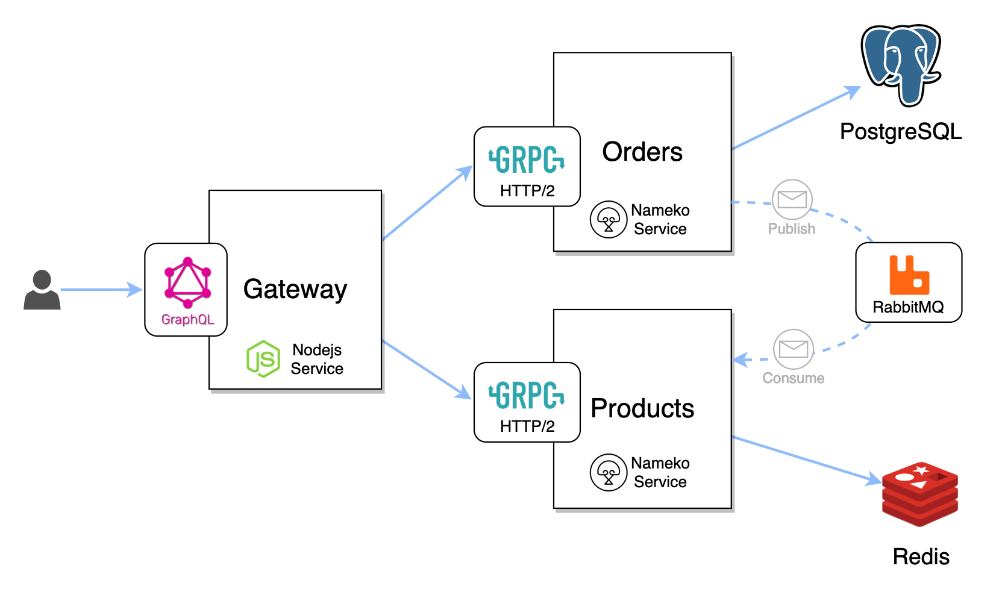
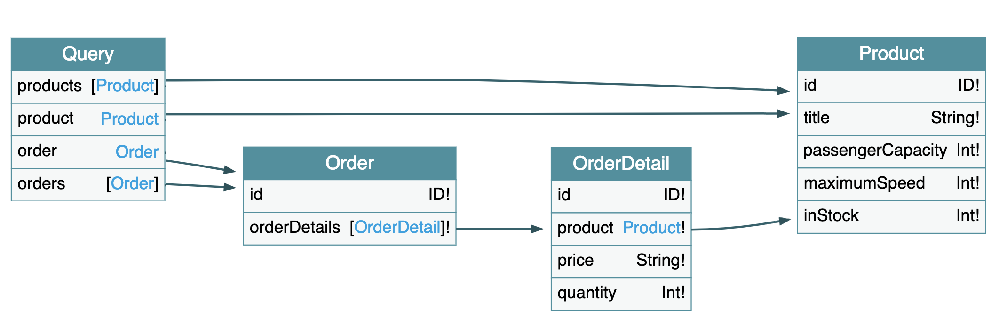
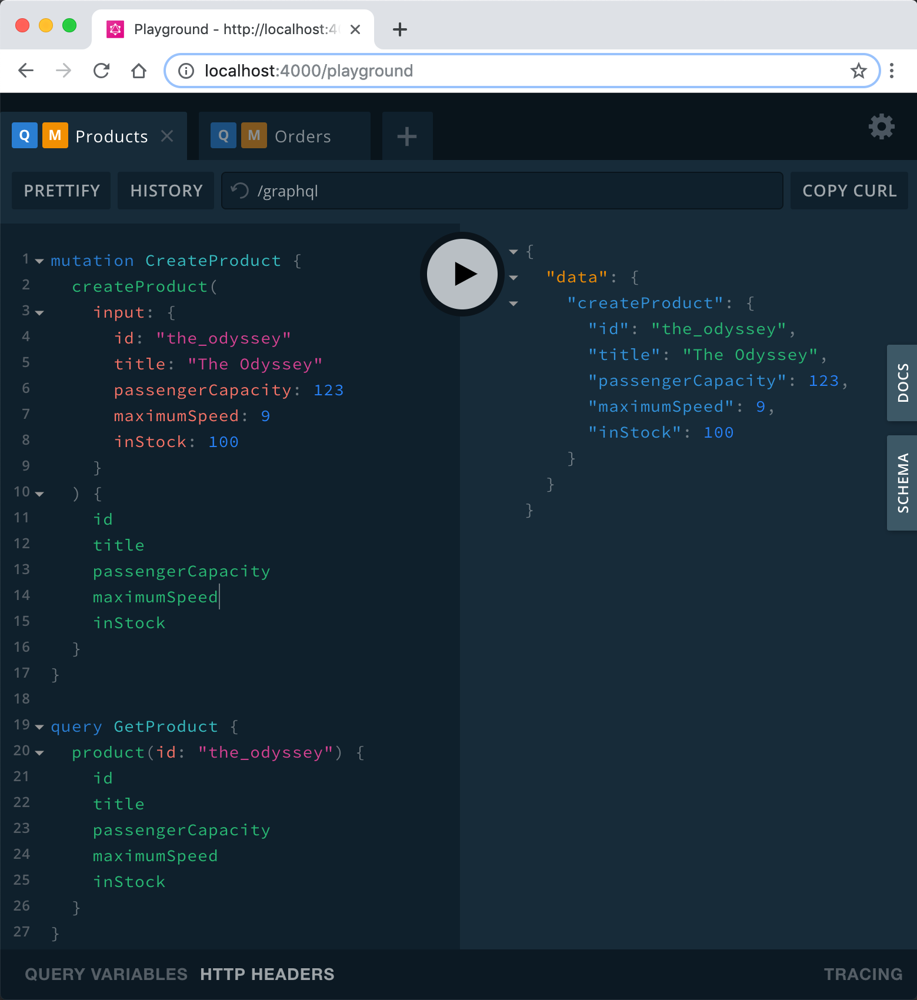

# Nameko gRPC Examples

This repository contains updated [Nameko Examples](https://github.com/nameko/nameko-examples) that demonstrate usage of new [nameko-grpc](https://github.com/nameko/nameko-grpc) library.

## Overview

[gRPC](https://grpc.io/) is a _"A high-performance, open-source universal RPC framework"_ and a great tool when building modern Microservices Architectures.  

Our example will demonstrate cross platform integration between NodeJS service exposing GraphQL API which will consume data from Nameko Services exposing gRPC APIs.

High level architecure overview of our examples:



We've got:
- **Gateway** - NodeJS Service with GraphQL API.
- **Orders** - Python Nameko Service with gRPC API and PostgreSQL as it's data store. This service will also publish `order_created` event.
- **Products** - Python Nameko Service with gRPC API and Redis as it's data store. This service will also consume `order_created` event.

## GraphQL Schema

Gateway NodeJS service exposes simple schema for our API

## Prerequisites 

For running examples locally we highly recommend setting up [python virtual environment](https://virtualenvwrapper.readthedocs.io/en/stable/) first.  
> **Examples have only been tested with Python 3.7 and NodeJS v10.15**


### Install Dependencies

Once you're in context of your virtual environment you can install dependencies by running `install-dependencies` make target:  
```sh
$ make install-dependencies
```
This will install both Python and NodeJS dependencies.

## Running Examples

To run and develop examples locally `nodemon` nodejs utility has to be installed globally:
```sh
$ sudo npm install -g nodemon --unsafe-perm=true --allow-root
```

Start examples by running `develop` make target:

```sh
$ make develop
```

All 3 services should be up and running now.

## Executing sample queries

GraphQL Playground utility has also started and can be accessed on `http://localhost:4000/playground` url.



Once there click **`PRETTIFY`** button on each tab to enable query selection.
You can execute queries in this order:

- Products Tab
  - CreateProduct
  - GetProduct
- Orders Tab
  - CreateOrder
  - GetOrder

## Kubernetes Integration

Kubernetes `charts` are included and Docker Images for all 3 services have been build and are available to be pulled form Docker Hub.

Set your desired kubernetes **`CONTEXT`** and **`NAMESPACE`** on top of main Makefile before running examples below.

Run `deploy-dependencies` make target to install RabbitMQ, Redis and PostgreSQL:

```sh
$ make deploy-dependencies
```

Run `deploy-services` make target to deploy Gateway, Products and Orders services to your desired namespace:

```sh
$ make deploy-services
```

Once everything is deployed and you verified pods are successfully running, use [Telepresence](https://www.telepresence.io/) tool to easily access resources inside of your cluster.  
Run `telepresence` make target to start a new session

```sh
$ make telepresence
```

Now you should be able to navigate to http://gateway/playground to play with the examples.

## Build Docker Images

When building docker images you can easily push them to your own Docker Hub Org by overriding default value of `DOCKER_HUB_ORG`:  
```sh
DOCKER_HUB_ORG=my_org make build-images push-images deploy-services
```
